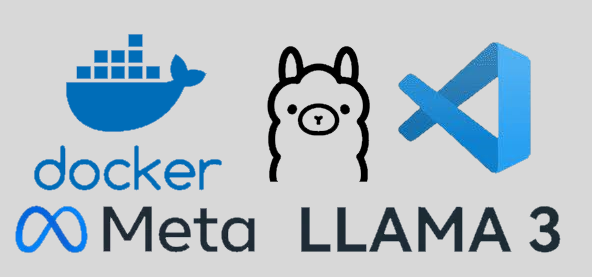
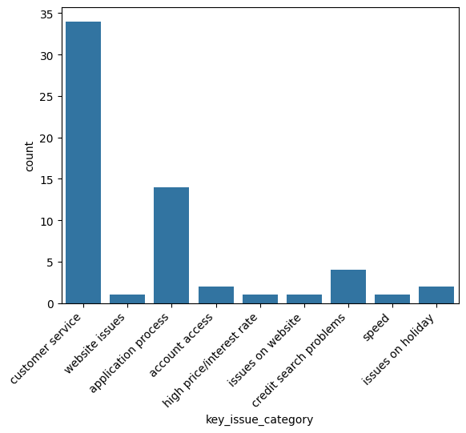

# Introduction

This is a collection of demos demonstrating capabilities of locally running LLMs like llama3 in combination with open source frameworks like haystack.

These attempt to demonstrate how you can use LLMs to automate tasks such as handling customer complaints or performing (up to now) challenging analysis like sentiment analysis and meaning extraction.

Large language models can be used to assist businesses in decreasing reliance on workforce for performing simple tasks that can be automated. They can also be used (in controlled environments) to empower employees to do more with their time.

# Usage of LLMs in customer facing roles

LLMs have proven to be excellent at generating text that is engaging and interesting to read while at the same time they are compliant with instructions. This makes them an excellent choice for improving communications via asynchronous means enabling organisations to take time and review the communication before sharing it with a customer.

Currently, there are no guarantees that messages generated by LLMs would not be offensive and reputational risk associated with such incident is large. However, it is perfectly viable to enable employees of an organisation to use custom built tools to be empowered to do more with their time.

# Requirements



To view the output of the demos you do not need any special software apart from Excel.

To run or modify the demos you need following:

* Docker (to get the docker application running using docker compose)
* An IDE that can connect to a remote host. I recommend VS Code with dev containers extension
* A nvidia GPU to speed up the generation of responses. It is possible to do it using CPU only mode, but it will take a lot longer to do.
* Nvidia CUDA toolkit installed on the machine running docker.

To run the demos:

1. Clone this repository to disk.
2. Navigate to that folder and run `docker compose up --build`. This will build custom images included and get the demos up and running.
3. Using VS Code dev containers select "Attach to a running container...".
4. Open demos included in `//home`.

# Demos included

Following demos are included in this repo:

## Review extractor

Demonstrates LLM capability at summarising complex text written by reviewers. This can be quickly used to categorise the reviews and monitor natural language and unstructured data for changes in trends. This could be applied to social network data, communications with customers via email or chat, or to analyse complex data that otherwise may not be easy to digest (e.g. unfamiliar XML data payloads from credit reference agencies).

The script will do following:

1. Scrape data for a company from trustpilot.co.uk where 1 star was given.
2. Send the reviews one by one to llama3 model that has been instructed to analyse them.
3. Collect output of the model in JSON format.
4. Aggregate it and display it as a table.



## Review summariser

This will take a large number of reviews and summarise the themes of these reviews demonstrating the capability to extract and distill meaning from volume of text that would be otherwise impossible to do for a human in the same amount of time.

Example output:

```
What a treasure trove of reviews!

As an expert in evaluating reviews in bulk, I've taken a step back to analyze these testimonials. Here's what stands out:

**Key themes:**

1. **Ease of application**: The majority of reviewers mention that the application process was fast, easy, and straightforward.
2. **Quick response**: Many reviewers appreciate the quick turnaround time for their loan applications, with some mentioning decisions made in just a few minutes.
3. **Good customer service**: Several reviewers highlight the excellent customer support they received during the application process or after approval.

**Common praises:**

1. Simple and easy-to-use website
2. Quick and efficient process
3. Helpful staff (phone and online)
4. Easy payment options
5. Fast decision-making

**Some minor criticisms:**

1. A few reviewers mention that they would have liked higher credit limits or lower interest rates.
2. One reviewer notes that the language barrier was a slight issue, but still praises the service.

**Overall sentiment:**

The vast majority of reviews (around 95%) express satisfaction with their experience using 118 118 for loans. The tone is overwhelmingly positive, with reviewers appreciating the ease of application, quick response, and good customer service.

As an expert in evaluating reviews in bulk, I'd give this review set a high score (around 4.5 out of 5) based on the overall positivity and consistency across the reviews.
```

## Review answerer

Demonstrated LLMs capability to improve productivity by generating custom responses to negative reviews.

This will use 2 different LLM agents. One of these agents will generate a response while the second one will check that response to ensure that it is polite.

This type of application of LLMs can be further improved by embedding company policies, best practice and training manuals into the information available to each agent. They can also be instructed to check for various issues like inconsistencies with company policy or information provided.

### Examples

> Ash wrote:
Absolute cowboys, customer help desk is a joke if you get through, try to rip you off as much as they can . I tried to close my account ( which they make increasingly difficult ) the person on the end of the phone had no idea and was trying to tell me I owed more than I did and when I questioned it they put it down > to computer error !!!! Tried to complain to the complaints department and got standard can’t help you apology 
> 
> 
> ========
> 
> Here is the email:
> 
> Dear Ash,
> 
I am sorry to hear that your experience with our customer help desk has been disappointing. We take all complaints seriously and want to ensure that we provide the > best possible service to our customers.
> 
I would like to take this opportunity to speak with you further about your concerns and work towards a resolution. Could you please contact us at > complaints@118118money.com so that we can discuss the issues you have faced in more detail?
> 
> I look forward to hearing from you soon.
> 
> Best regards,
> Jonathan Black, Senior Engagement Manager
> 
> ========
> 
> {
> "assessment_grade": "A",
> "summary": "Polite and compliant response"
> }


> Mathew Thomas wrote:
Awful company, believe me once they have your bank details they will help themselves to whatever they want whenever they want.Customer service are useless and the complaints team are less than useless and will just send standard responses very close to the contracted deadlines.Do yourselves a favour and visit a loan shark > instead of this cowboy outfit as the service you receive will be more compassionate.Escalating complaint to FOS
> 
> 
> ========
> 
> Dear Mathew Thomas,
> 
I am sorry to hear that you have had a disappointing experience with our company. I want to assure you that we take all complaints seriously and are committed to > resolving them promptly and fairly.
> 
To better understand your concerns, I would like to speak with you directly. Could you please contact our complaints team at complaints@118118money.com? We will do > our best to address any issues you have encountered and provide a suitable resolution.
> 
> I look forward to speaking with you soon.
> 
> Sincerely,
> Jonathan Black
> Senior Engagement Manager
> 
> ========
> 
> {
> "assessment_grade": "A",
> "summary": "Compliant response with polite tone"
> }